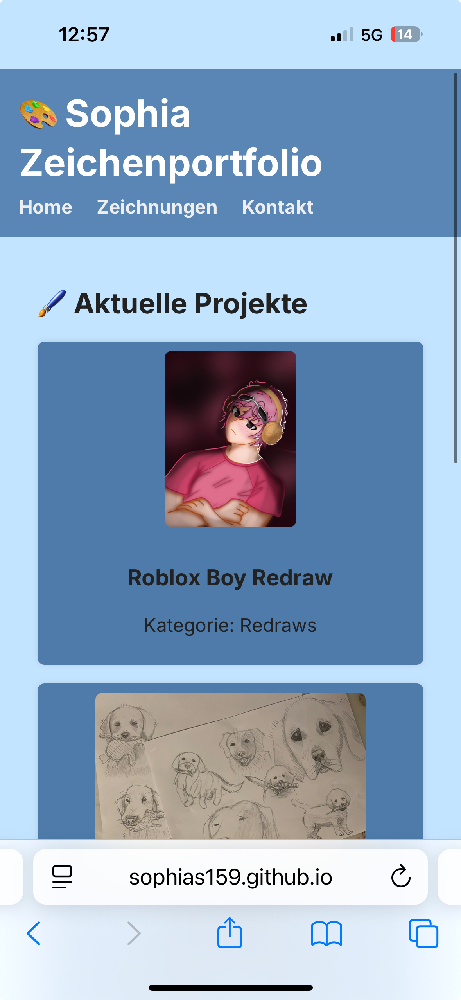
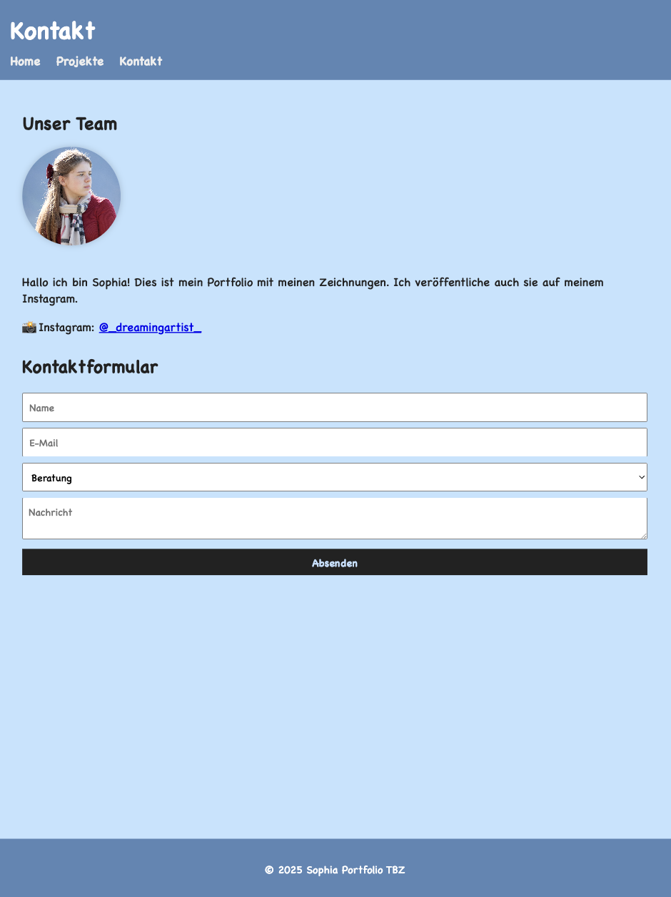
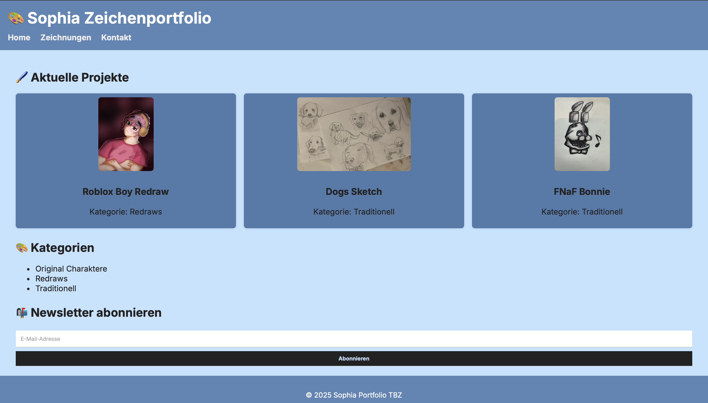

# 📐 Wireframes für Portfolio-Projekt

In diesem Dokument werden die geplanten Layouts (Wireframes) für das responsive Portfolio beschrieben. Die Wireframes dienen als visuelle Strukturhilfe für Mobile, Tablet und Desktop.

## 📱 Mobile Wireframe (≤ 768px)

## 📲 Tablet Wireframe (769px – 1024px)

## 💻 Desktop Wireframe (≥ 1025px)

## 💬 Hinweise

- Alle Layouts verwenden ein **CSS Grid-System**.
- Navigation wechselt bei kleiner Bildschirmbreite in ein **Hamburger-Menü**.
- Projektübersicht wird responsiv von 1 auf 2 oder 3 Spalten angepasst.
- Formulare sind **mobile-first** konzipiert.
- Fokus auf **klare Hierarchie** und gute Lesbarkeit.

---

